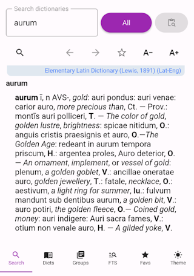

# Aurelex

**A fast, offline dictionary for Android** — a modern successor to the
discontinued [GoldenDict Mobile](http://goldendict.mobi).

Look up words in your own mdict and DSL dictionaries — or install one of our
free ones straight from the app, with no computer involved. Everything runs
on-device: no account, no ads, no network, no tracking.

<!-- Add a screenshot: save one as docs/screenshots/main.png and replace this
     comment with:
      -->

**[Download the latest release →](https://github.com/rg-software/aurelex/releases)** ·
Android 6.0+ · 64-bit ARM

## Install

Download the signed APK from [GitHub Releases](https://github.com/rg-software/aurelex/releases)
and open it on your phone, or push it over adb:

```bash
adb install <the-downloaded-apk>
```

The APK is built for **64-bit ARM (`arm64-v8a`)** and needs **Android 6.0 (API 23)**
or newer. A Google Play release is in progress; GitHub Releases is the channel
that is always current.

## Quick start

**You do not need to own any dictionary files to use Aurelex.**

1. Install the app and open it.
2. Go to the **Dictionaries** tab and tap **Add from remote**.
3. Install a dictionary from the catalog — a translation pair, or a
   monolingual one.
4. Go to **Search** and start typing.

The dictionary downloads once and is then searched entirely on-device, exactly
like one you imported yourself. Nothing is fetched again after that.

## Features

- **Offline lookup** — download a dictionary once, then search it entirely
  on-device. No network required, ever.
- **Built-in catalog** — install free dictionaries straight from the app, so you
  can be looking words up minutes after installing, with no computer involved.
- **Bring your own collection** — mdict and ABBYY Lingvo DSL, the formats large
  dictionary archives actually ship in.
- **Groups** — organise dictionaries into scopes (by language pair, by subject)
  and search only the ones you care about.
- **Full-text search** across every definition in your dictionaries, not just
  headwords.
- **Article rendering** with inline images, pronunciation audio (ogg / mp3 /
  wav) and working cross-reference links.
- **Search as you type**, with an in-article suggestion panel.
- **Browser-style back / forward** through your lookup history.
- **Article zoom** from 75% to 250% that reflows the text rather than just
  scaling it.
- **History and favorites** — history lives in the search screen, so it is never
  more than a tap away.
- **Light, dark, or follow the system.**
- **Look up from anywhere** — clipboard, the Quick Settings tile, the home-screen
  widget, the share menu, or Android's text-selection toolbar.

## Dictionary formats

| Format | Files | Status |
|---|---|---|
| mdict | `.mdx`, `.mdd` | Works |
| ABBYY Lingvo DSL | `.dsl`, `.dsl.dz` | Works (including sounds and images) |
| StarDict | `.ifo`, `.idx`, `.dict` + `res/` | Works (including article images) |

Anything else — BGL, SDict, XDXF, Aard, SLOB, GLS, Zim, EPWING, LSA — is not read
natively. If you have dictionaries in one of those formats, convert them on a
computer with [pyglossary](https://github.com/ilius/pyglossary), then import the
result. pyglossary's StarDict output (`.ifo`/`.idx`/`.dict`) imports directly;
its other output formats do not.

## Importing dictionaries

Aurelex copies dictionaries into its own private storage, so it never needs a
storage permission to read them:

1. Open the **Dictionaries** tab and tap **Add**.
2. Pick the folder holding your dictionary files. Subfolders are scanned as
   well, and any sibling `<name>.files` folder (DSL sounds and images) or `res/`
   folder (StarDict article images) is copied along with the dictionary.

Once the copy finishes, you can delete the original folder. Importing is
one-off — there is no "rescan", and **removing a dictionary in the app deletes
its copy and its index permanently**.

Large dictionaries are indexed for full-text search in the background; the app
stays usable while that runs.

> Android will not let the picker grant the storage root, `Download`, or
> `Android/data` — those appear greyed out. Pick an ordinary folder.

## Privacy

Everything happens on-device.

- No account, no sign-up, no ads, no analytics, no tracking.
- Your dictionaries are yours. They are never uploaded, and no lookup ever
  leaves the phone.
- Two things can touch the network, and only when you ask:
  - the **remote catalog**, which is read when you open the *Add from remote*
    screen; and
  - remote resources referenced from inside an article, if a dictionary you
    installed contains any.
- The GitHub build sends nothing at all. If you install a Google Play build,
  Google Play may report crashes to the developer, exactly as it does for any
  Play app.

## Limitations

Aurelex is early software (0.3) and the polish is uneven. Known problems:

- **Speex audio (`.spx`) is skipped silently.** ogg, mp3 and wav play.
- **The catalog is a starter collection, not a library.** It carries enough
  dictionaries to be genuinely useful on its own, but a serious dictionary habit
  will outgrow it — that is what the import path is for.
- **The release APK is larger than it needs to be**, because it packages the
  whole Qt runtime. Trimming it is planned.

## Building from source

Requirements: JDK 17, the Android SDK and NDK, Qt 6.6.3 (Android and desktop
kits), **PowerShell 7**, and the vcpkg dependencies listed in the docs.

```powershell
git clone --recursive https://github.com/rg-software/aurelex.git
cd aurelex

.\scripts\apply-patches.ps1                                  # patch the engine tree
pwsh -File .\app\build.ps1 -Configuration Debug -Install      # build, push, launch
```

Full instructions — toolchain setup, the host test targets, the engine smoke
test and the translation workflow — are in **[`docs/DEVELOPMENT.md`](docs/DEVELOPMENT.md)**.

Non-trivial work is planned as an OpenSpec change under `openspec/` before it is
implemented; see [`AGENTS.md`](AGENTS.md) for the working contract.

## License and credits

Aurelex is free software under the **GNU GPL v3 or later** — see [`LICENSE`](LICENSE).

It is an **independent** project built on the
[goldendict-ng](https://github.com/xiaoyifang/goldendict-ng) dictionary engine,
which is itself derived from the original GoldenDict by Konstantin Isakov. All of
the dictionary-format parsing is their work, not ours; [`docs/ENGINE.md`](docs/ENGINE.md)
records exactly which revision Aurelex builds on and how we track it.

The dictionaries offered in the built-in catalog are **not** part of Aurelex and
are not covered by its licence. Each one carries its own — most are share-alike,
derived from Wiktionary and similar sources — and the app shows the entry's
attribution and licence before you install it.